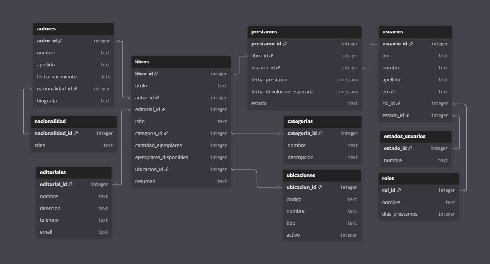

# Proyecto Diplomatura Python: Gestión de Biblioteca

## Objetivo del Proyecto

Este proyecto es una versión reducida del sistema completo de gestión de bibliotecas desarrollado como ejemplo en la diplomatura. En esta versión se ha dejado implementada únicamente la parte del backend relacionada con la gestión de **autores**.

Su misión, si decide aceptarla, es **completar el backend** implementando las funcionalidades faltantes para la gestión de:

- [ ] Gestión de libros
- [ ] Gestión de préstamos  
- [ ] Gestión de usuarios

**Objetivo de aprendizaje**: Aplicar conceptos de desarrollo backend con Python y FastAPI.

De esta forma podrán aplicar los conceptos vistos en clases y consolidar habilidades en desarrollo backend con Python.

---

## Stack Tecnológico

### Backend
- Python 3.10+
- FastAPI (Web framework)
- SQLAlchemy 2.0 (ORM)
  
### Base de Datos
- SQLite (por defecto)
- PostgreSQL (recomendado para desarrollo)

### Frontend
- Templates HTML (Jinja2)
- Bootstrap (opcional)

---

## Instrucciones para los Alumnos

1. Realizar un **fork** de este repositorio a su propia cuenta de GitHub.  
2. Clonar su fork localmente con:  
   ```bash
   git clone https://github.com/usuario/diplomatura-python-bases
   ```

## Estructura del Proyecto

El proyecto cuenta actualmente con la siguiente organización básica de carpetas y archivos:

```plaintext
DIPLOMATURA-PYTHON-BASES/
├── app/
│   ├── api/
│   │   ├── autores.py        # Endpoints backend para autores
│   │   └── wikipedia.py      # Integración con Wikipedia API
│   ├── core/
│   │   ├── autores.py        # CRUD autores
│   │   ├── database.py       # Configuración DB
│   │   └── nacionalidades.py # CRUD nacionalidades
│   ├── frontend/
│   │   └── autores.py        # Endpoints frontend para autores (HTML/Jinja2)
│   ├── models/
│   │   ├── __init__.py       # Exporta modelos principales (Autor, Nacionalidad)
│   │   ├── autores.py        # Modelo autores
│   │   └── nacionalidades.py # Modelo nacionalidades
│   ├── schemas/
│   │   └── autores.py        # Esquemas Pydantic
│   ├── instance/             # Instancia DB (Flask)
│   ├── static/               # Archivos estáticos (CSS/JS)
│   └── templates/
│       ├── autores/
│       │   ├── create.html   # Creación autores
│       │   ├── detail.html   # Detalle autor
│       │   └── list.html     # Listado autores
│       ├── libros/
│       │   ├── create.html   # Creación libros
│       │   ├── detail.html   # Detalle libro
│       │   └── list.html     # Listado libros
│       ├── prestamos/
│       │   ├── create.html   # Creación de préstamos
│       │   └── list.html     # Lista de préstamos
│       ├── usuarios/
│       │   ├── create.html   # Creación usuarios
│       │   ├── detail.html   # Detalle usuari
│       │   └── list.html     # Listado usuarios
│       ├── base.html         # Template base
│       └── navbar.html       # Barra navegación
├── .gitignore                # Archivos ignorados por Git
├── example.env               # Plantilla variables entorno
├── LICENSE                   # Licencia del proyecto
├── main.py                   # Punto entrada aplicación
├── README.md                 # Documentación principal
└── requirements.txt          # Dependencias Python
```

* Se debe crear el archivo .env para utilizarlo.

---

### Tareas para Completar

Actualmente, el proyecto tiene implementada sólo la gestión completa de autores (modelos, esquemas, rutas API y frontend).

Como parte del trabajo, deberán:

- Crear los modelos SQLAlchemy para **libros**, **préstamos** y **usuarios** en `app/models/`.
- Definir los esquemas Pydantic correspondientes en `app/schemas/`.
- Implementar la lógica de negocio en `app/core/`.
- Crear los endpoints API REST en `app/api/`.
- Desarrollar las vistas y rutas frontend en `app/frontend/`.
- Utilizar, modificar, ó crear los templates HTML para estas nuevas entidades en las carpetas correspondientes dentro de `app/templates/`.

#### Ejemplo de utilización de la plantilla `app/templates/autores/list.html`:

```python
@router.get("/autores", response_class=HTMLResponse)
async def list_autores(request: Request):
    autores = db.get_todos()
    return templates.TemplateResponse("autores/list.html", {"request": request, "autores": autores})
```

`TemplateResponse` llama al html deseado, y envía las variables necesarias dentro de un diccionario. Dentro del html, las variables deben ser utilizadas con el mismo nombre.

---

# Diagrama Entidad-Relación (DER)

[](https://dbdiagram.io/d/DER-library-687aa952f413ba35089d01b9)

## Tablas Principales

### autores
- `autor_id` ⚠ INTEGER (PK)
- `nombre` TEXT
- `apellido` TEXT
- `fecha_nacimiento` DATE
- `nacionalidad_id` ⚠ INTEGER (FK)
- `biografía` TEXT

### nacionalidad
- `nacionalidad_id` ⚠ INTEGER (PK)
- `sdes` TEXT

### libros
- `libro_id` ⚠ INTEGER (PK)
- `titulo` TEXT
- `autor_id` ⚠ INTEGER (FK)
- `editorial_id` ⚠ INTEGER (FK)
- `isbn` TEXT
- `categoria_id` ⚠ INTEGER (FK)
- `cantidad_ejemplares` INTEGER
- `ejemplares_disponibles` INTEGER
- `ubicacion_id` ⚠ INTEGER (FK)
- `resumen` TEXT

### editoriales
- `editorial_id` ⚠ INTEGER (PK)
- `nombre` TEXT
- `direccion` TEXT
- `telefono` TEXT
- `email` TEXT

### categorias
- `categoria_id` ⚠ INTEGER (PK)
- `nombre` TEXT
- `descripcion` TEXT

### prestamos
- `prestamo_id` ⚠ INTEGER (PK)
- `libro_id` ⚠ INTEGER (FK)
- `usuario_id` ⚠ INTEGER (FK)
- `fecha_prestamo` TIMESTAMP
- `fecha_devolucion_esperada` TIMESTAMP
- `estado` TEXT

### roles
- `rol_id` ⚠ INTEGER (PK)
- `nombre` TEXT
- `dias_prestamos` INTEGER

### estados_usuarios
- `estado_id` ⚠ INTEGER (PK)
- `nombre` TEXT

### usuarios
- `usuario_id` ⚠ INTEGER (PK)
- `dni` TEXT
- `nombre` TEXT
- `apellido` TEXT
- `email` TEXT
- `rol_id` ⚠ INTEGER (FK)
- `estado_id` ⚠ INTEGER (FK)

### ubicaciones
- `ubicacion_id` ⚠ INTEGER (PK)
- `codigo` TEXT
- `nombre` TEXT
- `tipo` TEXT
- `activo` INTEGER
## Relaciones

1. **autores** → **nacionalidad** (N:1)
   - `autores.nacionalidad_id` referencia `nacionalidad.nacionalidad_id`

1. **libros** → **autores** (N:1)
   - `libros.autor_id` referencia `autores.autor_id`

1. **libros** → **editoriales** (N:1)
   - `libros.editorial_id` referencia `editoriales.editorial_id`

1. **libros** → **categorias** (N:1)
   - `libros.categoria_id` referencia `categorias.categoria_id`

1. **libros** → **ubicaciones** (N:1)
   - `libros.ubicacion_id` referencia `ubicaciones.ubicacion_id`

1. **prestamos** → **libros** (N:1)
   - `prestamos.libro_id` referencia `libros.libro_id`

1. **prestamos** → **usuarios** (N:1)
   - `prestamos.usuario_id` referencia `usuarios.usuario_id`

1. **usuarios** → **roles** (N:1)
   - `usuarios.rol_id` referencia `roles.rol_id`

1. **usuarios** → **estados_usuarios** (N:1)
   - `usuarios.estado_id` referencia `estados_usuarios.estado_id`

## Notas
- ⚠ = Campo obligatorio/Clave
- PK = Primary Key (Clave Primaria)
- FK = Foreign Key (Clave Foránea)
- La estructura permite ampliación con tablas adicionales (usuarios, roles, etc.)
